# 📚 포팅 메뉴얼

## 🛠️ 1. 사용 도구

### 협업 도구

| **구분** | **도구** |
| --- | --- |
| 이슈 관리 | Jira |
| 형상 관리 | GitLab, Git |
| 커뮤니케이션 | Notion, Mattermost, Kakao Talk |

### 배포 도구

| **구분** | **도구** |
| --- | --- |
| CI/CD | Jenkins, Docker |
| 클라우드 | AWS EC2 |

### 설계 도구

| **구분** | **도구** |
| --- | --- |
| 와이어프레임 | Figma |
| ERD | dbdiagram.io |
| 문서 작성 | Notion |
| 시스템 아키텍쳐 | cloudcraft |

### 개발 도구

| **구분** | **도구** |
| --- | --- |
| IDE | Visual Studio Code, IntelliJ |
| GPU 서버 | Colab |

### AI

| **구분** | **도구** |
| --- | --- |
| LLM | Gemma-3B (4bit QLoRA 파인튜닝) |
| 파인튜닝 | Unsloth 사용 (QLoRA 기반) |
| 추론 서버 | FastAPI + uvicorn (로컬 REST API) |
| RAG 구조 | FAISS (유사도 검색) + BM25 (재정렬), MongoDB |
| 임베딩 모델 | all-MiniLM-L6-v2 (from SentenceTransformers) |

## 💻 2. 개발 환경

### Frontend

```json
{
  "name": "frontend",
  "version": "0.1.0",
  "private": true,
  "scripts": {
    "dev": "next dev --turbopack",
    "build": "next build",
    "start": "next start",
    "lint": "next lint"
  },
  "dependencies": {
    "@tanstack/react-query": "^5.75.0",
    "axios": "^1.9.0",
    "next": "15.3.1",
    "react": "^19.0.0",
    "react-dom": "^19.0.0"
  },
  "devDependencies": {
    "@eslint/eslintrc": "^3",
    "@tailwindcss/postcss": "^4",
    "@types/node": "^20",
    "@types/react": "^19",
    "@types/react-dom": "^19",
    "eslint": "^9",
    "eslint-config-next": "15.3.1",
    "tailwindcss": "^4",
    "typescript": "^5"
  }
}
```

### Backend

| 구성 요소 | 라이브러리 / 프레임워크 | 버전 |
|----------|--------------------------|-------|
| Java | OpenJDK | 17 |
| Spring Boot | spring-boot-starter-* | 3.4.5 |
| Dependency Management | io.spring.dependency-management | 1.1.7 |
| Web | spring-boot-starter-web | Spring Boot 관리 |
| Security | spring-boot-starter-security<br>spring-security-oauth2-jose | Spring Boot 관리 |
| Data | spring-boot-starter-data-mongodb | Spring Boot 관리 |
| Validation | spring-boot-starter-validation | Spring Boot 관리 |
| OAuth2 Client | spring-boot-starter-oauth2-client | Spring Boot 관리 |
| Web Services | spring-boot-starter-web-services | Spring Boot 관리 |
| Dev Tools | spring-boot-devtools | Spring Boot 관리 |
| JWT | jjwt-api / jjwt-impl / jjwt-jackson | 0.11.5 |
| Swagger / OpenAPI | springdoc-openapi-starter-webmvc-ui | 2.8.8 |
| Swagger Annotations | swagger-annotations-jakarta | 2.2.30 |
| Lombok | lombok | Gradle 최신 버전 사용 |
| Test | spring-boot-starter-test<br>spring-security-test | Spring Boot 관리 |
| JUnit | junit-platform-launcher | Spring Boot 관리 |

### Infrastructure

| 구분 | 버전/용도 |
| --- | --- |
| AWS t2.xlarge | CPU: 4 vCPUs, RAM: 16GB, OS: Ubuntu |
| Ubuntu | 22.04.5 LTS |
| Nginx | 1.27.4 |
| Docker | 28.0.1 |
| Jenkins | 2.501 |

### 포트 설정

#### 현재 포트 상태 확인

```bash
sudo ufw status
```

결과 예시:
```
Status: active

To                         Action      From
--                         ------      ----
22                         ALLOW       Anywhere                  
80                         ALLOW       Anywhere                  
44                         ALLOW       Anywhere                  
8989                       ALLOW       Anywhere                  
443                        ALLOW       Anywhere                  
443/tcp                    ALLOW       Anywhere                  
9000                       ALLOW       Anywhere                  
50000                      ALLOW       Anywhere                  
8888/tcp                   ALLOW       Anywhere                       
```

#### 포트 활성화/비활성화

```bash
# UFW 활성화
sudo ufw enable

# 특정 포트 열기
sudo ufw allow 8080    # 8080 포트 개방
sudo ufw allow 80      # HTTP 포트
sudo ufw allow 443     # HTTPS 포트

# 특정 포트 차단
sudo ufw deny 8080     # 8080 포트 차단
sudo ufw delete allow 8080  # 기존 허용 규칙 삭제
```

#### 프로젝트에 사용한 포트 번호

| 구분 | EC2 | Docker |
| --- | --- | --- |
| SSH 접속 | 22 | 22 |
| HTTP 접속 | 80 | 80 |
| HTTPS 접속 | 443 | 443 |
| Nginx | 80, 443 | 80, 443 |
| React | 3000 | 3000 |
| SpringBoot | 8080 | 8080 |
| FastAPI | 8000 | 8000 |
| Gerrit | 8989 | 8989 |
| Jenkins | 8888, 50000 | 8080, 50000 |
| Portainer | 9000, 50001 | 9000, 50000 |

## ⚙️ 3. 환경 변수 설정

### Backend

```bash
MONGODB_URI=

# Google Login
GOOGLE_CLIENT_ID=
GOOGLE_CLIENT_SECRET=
GOOGLE_SCOPE=

# GitHub Login
GITHUB_CLIENT_ID=
GITHUB_CLIENT_SECRET=
GITHUB_SCOPE=

GOOGLE_REDIRECT_URI=
GITHUB_REDIRECT_URI=

# jwt config
JWT_SECRET=
# AccessToken
JWT_ACCESS_TOKEN_VALIDITY_IN_SECONDS=
# RefreshToken
JWT_REFRESH_TOKEN_VALIDITY_IN_SECONDS=

# development frontend url
APP_FRONTEND_URL=
```

### Frontend

```bash
NEXT_PUBLIC_API_URL=
```

## 🚀 4. 배포 가이드

### 4.1 서버 세팅

#### 서버 기본 설정

```bash
# 패키지 업데이트
sudo apt update
sudo apt upgrade
```

#### Docker 설치(EC2/Linux)

```bash
# 의존성 설치
sudo apt update
sudo apt install ca-certificates curl gnupg lsb-release

# 레포지토리
sudo mkdir -p /etc/apt/keyrings
sudo curl -fsSL https://download.docker.com/linux/debian/gpg | sudo gpg --dearmor -o /etc/apt/keyrings/docker.gpg

# 레포지토리 추가
echo "deb [arch=$(dpkg --print-architecture) \
signed-by=/etc/apt/keyrings/docker.gpg] https://download.docker.com/linux/ubuntu \
$(. /etc/os-release && echo "$VERSION_CODENAME") stable" | sudo tee /etc/apt/sources.list.d/docker.list > /dev/null

# 도커 설치하기
sudo apt update
sudo apt install docker-ce docker-ce-cli containerd.io docker-compose-plugin
```

#### Dockerfile 생성

##### Backend/Dockerfile

```dockerfile
FROM gradle:7.5-jdk17 AS builder

WORKDIR /app

COPY build.gradle .
COPY settings.gradle .
# 필요한 경우 gradlew 및 gradlew.bat 파일도 복사합니다.
COPY gradlew .
COPY gradlew.bat .

# 의존성 파일들을 복사하여 의존성 다운로드 단계의 캐시를 활용합니다.
COPY .gradle/wrapper ./gradle/wrapper
# RUN gradle clean build --no-daemon --refresh-dependencies # 의존성만 미리 다운로드하는 단계 (선택 사항)

COPY src ./src

RUN gradle clean build --no-daemon -x test


FROM openjdk:17-jre-slim

WORKDIR /app

COPY --from=builder /app/build/libs/MCPanda-*.jar /app/app.jar

EXPOSE 8080

ENTRYPOINT ["java", "-jar", "app.jar"]
```

##### Frontend/Dockerfile

```dockerfile
# 1. 빌드 단계
FROM node:22-alpine AS builder

WORKDIR /app

COPY package*.json ./

RUN npm install

COPY . .

RUN npm run build

# 2. 프로덕션 실행 단계
FROM nginx:stable-alpine

WORKDIR /app

ENV NODE_ENV=production

# standalone output에서 필요한 파일들 복사
# /app/public 폴더 복사
COPY --from=builder /app/public ./public
# /app/.next/standalone 폴더를 현재 디렉토리(/app)로 복사
COPY --from=builder /app/.next/standalone ./
# /app/.next/static 폴더를 현재 디렉토리의 .next 폴더 아래로 복사
COPY --from=builder /app/.next/static ./.next/static

# (선택 사항이지만 권장) 보안을 위해 non-root 사용자 사용
# Docker 이미지에 해당 사용자가 미리 정의되어 있거나, 여기서 생성해야 합니다.
# 공식 Next.js 이미지는 nextjs 사용자를 제공합니다. (FROM node:20-alpine 대신 FROM nextjs/node:20-alpine 사용 고려)
# RUN addgroup --system --gid 1001 nodejs
# RUN adduser --system --uid 1001 nextjs
# USER nextjs

EXPOSE 3000

# standalone output은 server.js 파일을 직접 실행합니다.
CMD ["node", "server.js"]
```

### 4.2 Jenkins 설정

#### Jenkins 컨테이너 생성

```bash
docker run --name jenkins -d \
-p 8888:8080 -p 50000:50000 \
-v /home/ubuntu/jenkins:/var/jenkins_home \
-v /var/run/docker.sock:/var/run/docker.sock \
jenkins/jenkins:lts
```

#### Jenkins 버전 최신화

```bash
# 로컬 터미널에서 실행
scp -i K12B108T.pem jenkins.war ubuntu@k12b108.p.ssafy.io:/home/ubuntu/

# EC2 터미널에서 실행
sudo docker cp /home/ubuntu/jenkins.war jenkins:/usr/share/jenkins/jenkins.war

# 권한 설정 및 재시작
sudo docker exec jenkins chown jenkins:jenkins /usr/share/jenkins/jenkins.war
sudo docker restart jenkins

# docker jenkins 컨테이너 실행
sudo docker start jenkins

# docker 컨테이너 실행 로그 확인
sudo docker logs jenkins
```

#### Jenkins 전용 docker-compose.yml 파일 생성

```yaml
services:
  jenkins:
    image: jenkins/jenkins:lts
    container_name: jenkins
    user: root
    privileged: true
    ports:
      - "8888:8080"
      - "50000:50000"
    volumes:
      - jenkins_home:/var/jenkins_home
      - /var/run/docker.sock:/var/run/docker.sock
      - /usr/bin/docker:/usr/bin/docker

    environment:
      - TZ=Asia/Seoul
    restart: always

volumes:
  jenkins_home:
    external: true
```

#### Pipeline 설정
- Jenkins 파이프라인 생성
  
  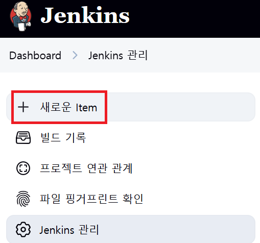

  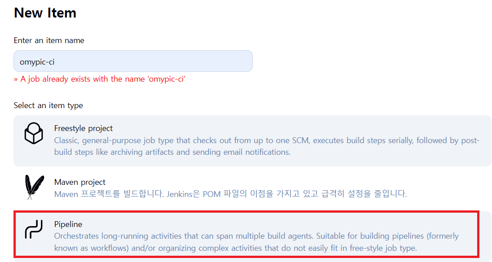

  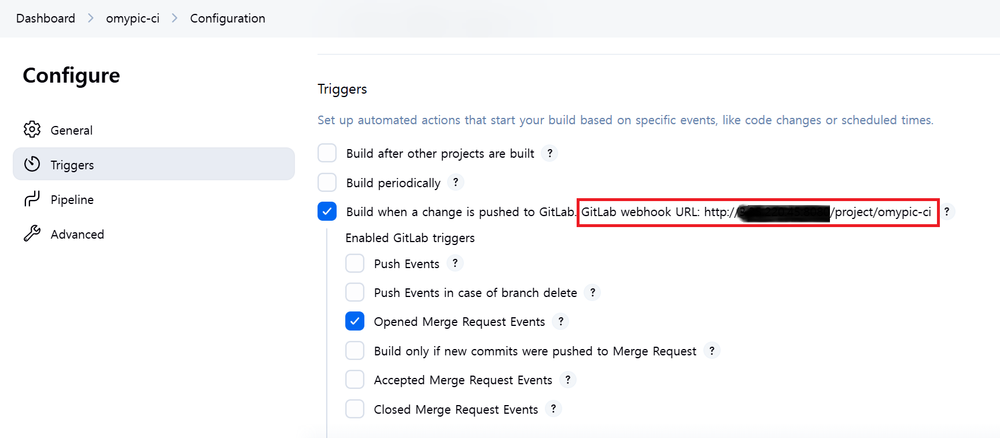

  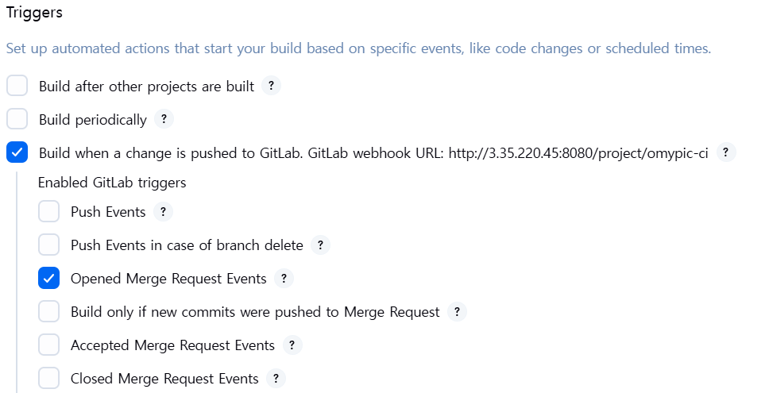
----------------------------------------------
- GitLab Webhook 설정

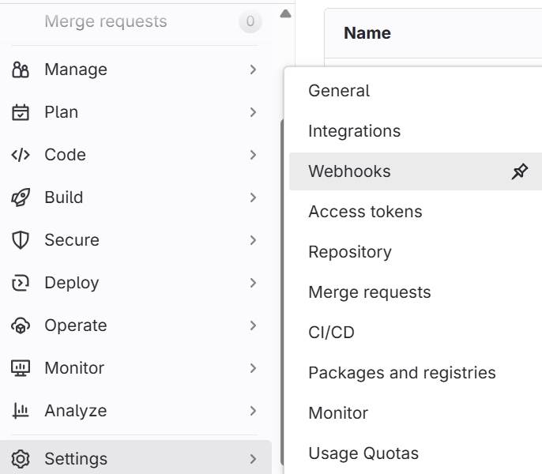

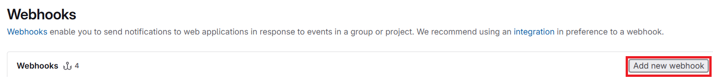

- URL에 Jenkins 파이프라인 주소를 매핑

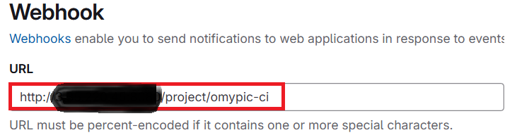

- Jenkins의 secretToken을 webhook에 설정

- Jenkins - Configure - Trigger - Build when a change.. - 고급 클릭

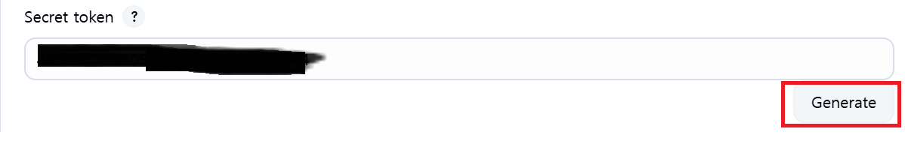

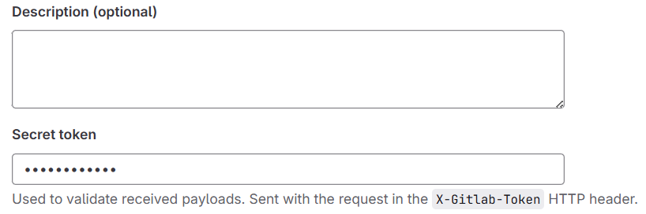

- Test events 눌러서 webhook 연동 확인

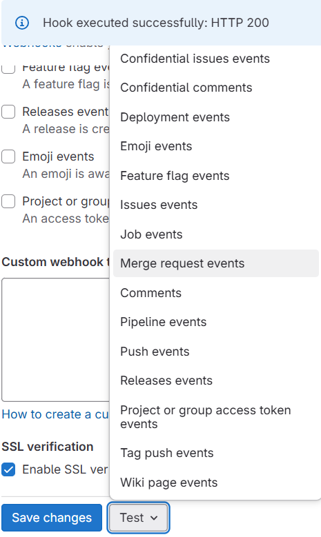

- Merge Requrest events는 Jenkins에 바로 적용 안되는 경우가 많음 -> Test를 위해서 Push event로 설정하고 테스트
------------------------------------------------
- 환경변수 설정

- Jenkins 관리 - Security - Credentials 클릭

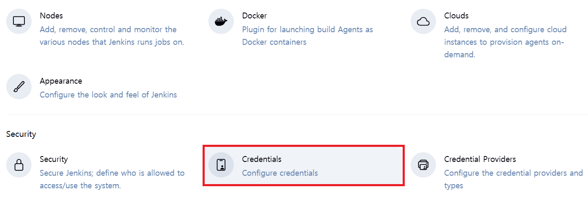

- global - Add credentials 클릭

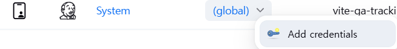

- gitlab accessToken Jenkins에 등록 (gitlab settings에서 access tokens 클릭)


- Add new token 클릭

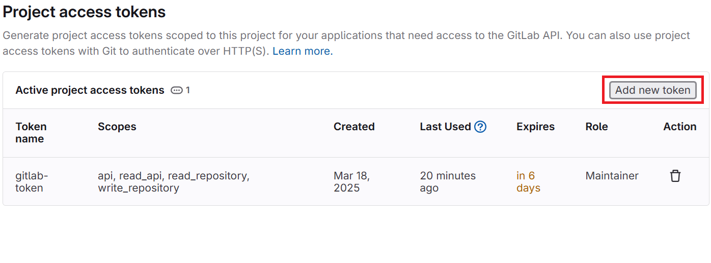

- token name과 role 설정(Maintainer or Developer)

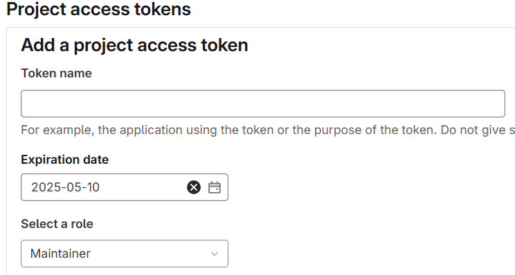

- scope 설정 및 토큰 생성


- 생성된 토큰 번호 확인 및 저장 (확인 기회 1번뿐! 반드시 저장할 것)

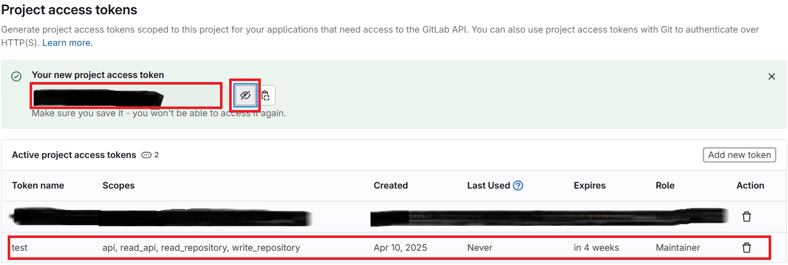

- gitlab token을 jenkins에 등록

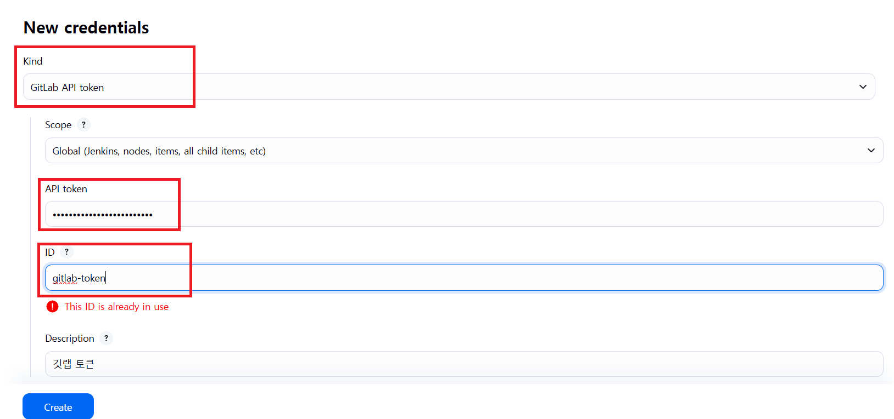

- Kind: GitLab API token
- API token: gitlab에서 발급받은 token 기입
- ID: Jenkins에서 사용할 토큰 이름
- Create 클릭!
-------------------------------------------------------  
- gitlab 유저 등록 
  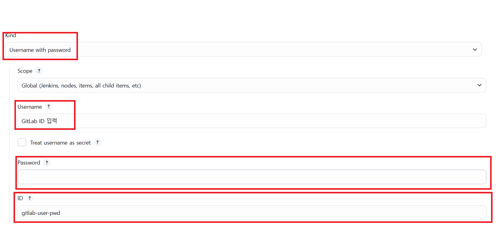

  - Kind: Username with password
  - Username: Gitlab ID
  - Password: Gitlab Password
  - ID: Jenkins 환경변수로 쓸 이름 ex. gitlab-user-pwd
  - Create 클릭!
--------------------------------------------------------

#### Jenkins 파이프라인 코드
- Jenkinsfile
```Jenkinsfile
pipeline {
    agent any
    environment {
        DOCKERHUB_CREDENTIALS = credentials('dockerhub-credentials') // Docker Hub 인증 정보 ID
        DOCKER_REGISTRY = "kimjuheee"
        BACKEND_IMAGE = "${DOCKER_REGISTRY}/mcpanda-backend" // 백엔드 Docker 이미지 이름
        FRONTEND_IMAGE = "${DOCKER_REGISTRY}/mcpanda-frontend" // 프론트엔드 Docker 이미지 이름
        GIT_AUTHOR_ID = "${env.gitlabUserName}"
        GIT_AUTHOR_EMAIL = "${env.gitlabUserEmail ?: 'Not set'}"
        NEXT_PUBLIC_API_URL = 'https://mcpanda.co.kr'
        DEPLOY_DIR = '/home/ubuntu/S12P31B108'
    }
    
    tools {
        nodejs 'NodeJS-LTS'
    }
    
    stages {
        stage('Checkout (Initial)') {
            steps {
                checkout([
                    $class: 'GitSCM',
                    branches: [[name: "dev"]], // 빌드 대상 브랜치
                    userRemoteConfigs: [[url: 'https://lab.ssafy.com/s12-final/S12P31B108.git', credentialsId: 'gitlab-user']] // GitLab 인증 정보 ID
                ])
                
                sh 'pwd' // 현재 작업 디렉토리 출력 추가
                sh 'git status' // Git 상태 확인 추가
                
                script {
                    env.GIT_COMMIT = sh(script: 'git rev-parse HEAD', returnStdout: true).trim()
                
                    if (env.GIT_COMMIT && env.GIT_COMMIT.length() >= 8) {
                        env.GIT_COMMIT_SHORT = env.GIT_COMMIT[0..7]
                    } else {
                        env.GIT_COMMIT_SHORT = 'unknown'
                    }
                
                    echo "Debug: Full GIT_COMMIT value: ${env.GIT_COMMIT}"
                    echo "Checked out commit (Short): ${env.GIT_COMMIT_SHORT}"
                }
            }
        }

        stage('Check Target Branch') {
            steps {
                script {
                    if (env.gitlabTargetBranch != 'dev'&& env.BRANCH_NAME != 'dev') {
                        error("This pipeline only runs for pushes targeting the dev branch. (Current target: ${env.gitlabTargetBranch ?: env.BRANCH_NAME})")
                     } else {
                         echo "Target branch is dev. Proceeding."
                    }
                }
            }
        }

        stage('Build & Push Images') {
            parallel {
                stage('Backend') {
                    when { changeset "backend/**" }
                    steps {
                        script {
                            sh 'cd backend'
                            buildAndPushImage("${BACKEND_IMAGE}", "./backend")
                        }
                    }
                }
                stage('Frontend') {
                    when { changeset "frontend/**" }
                    steps {
                        script {
                            buildAndPushImage("${FRONTEND_IMAGE}", "./frontend")
                        }
                    }
                }
            }
        }

        stage('Deploy to Target') {
            steps {
                withCredentials([
                    sshUserPrivateKey(credentialsId: 'my-ssh-credentials', keyFileVariable: 'SSH_KEY')
                ]) {
                    sh """
                    ssh -v -i \$SSH_KEY -o StrictHostKeyChecking=no ubuntu@43.203.241.152 "
                    set -e
                    
                    docker logout || true 
    
                    cd ${DEPLOY_DIR}
                    docker image pull ${BACKEND_IMAGE}:latest
                    docker image pull ${FRONTEND_IMAGE}:latest
                    docker compose down
                    docker compose up -d
                    "
                """
                }
            }
        }
    }

    post {
        success {
            script {
                mattermostSend(
                    color: 'good',
                    message: "빌드 성공: ${env.JOB_NAME} #${env.BUILD_NUMBER} by ${env.GIT_AUTHOR_ID}(${env.GIT_AUTHOR_EMAIL})\n(<${env.BUILD_URL}|Details>)",
                    endpoint: 'https://meeting.ssafy.com/hooks/8z4cpfyamtygipmzmhoz4d83jw',
                    channel: 'B108-Jenkins'
                )
            }
            echo 'CI Pipeline succeeded! Images have been built and pushed to Docker Hub.'
        }
        failure {
            script {
                mattermostSend(
                    color: 'danger',
                    message: "빌드 실패: ${env.JOB_NAME} #${env.BUILD_NUMBER} by ${env.GIT_AUTHOR_ID}(${env.GIT_AUTHOR_EMAIL})\n(<${env.BUILD_URL}|Details>)",
                    endpoint: 'https://meeting.ssafy.com/hooks/8z4cpfyamtygipmzmhoz4d83jw',
                    channel: 'B108-Jenkins'
                )
            }
            echo 'CI Pipeline failed! Check the logs for details.'
        }
        always {
            script {
                sh 'docker image prune -f'
            }
            cleanWs()
        }
    }
}

def buildAndPushImage(String imageName, String context) {
    docker.withRegistry('https://index.docker.io/v1/', 'dockerhub-credentials') {
        sh """
            docker build -t ${imageName}:${env.GIT_COMMIT_SHORT} -t ${imageName}:latest ${context}
            docker push ${imageName}:${env.GIT_COMMIT_SHORT}
            docker push ${imageName}:latest
        """
    }
}
```


### 4.3 Nginx 설정

#### SSL 인증서 발급

```bash
docker exec -it nginx bash
apt-get update
apt-get install certbot python3-certbot-nginx
certbot --nginx -d mcpanda.co.kr
```

#### Nginx 설정 파일(nginx/default.conf)

```nginx
# <로컬 프로젝트 경로>/nginx/default.conf
server {
    listen 80; # Nginx가 외부에서 80번 포트로 요청을 받음
    server_name mcpanda.co.kr www.mcpanda.co.kr;

    # HTTP -> HTTPS 리다이렉트 설정 (권장)
    return 301 https://$host$request_uri;

}

server {
    listen 443 ssl;
    server_name mcpanda.co.kr www.mcpanda.co.kr; # 실제 도메인으로 변경

    # Certbot으로 발급받은 인증서 파일 경로 지정
    ssl_certificate /etc/letsencrypt/live/mcpanda.co.kr/fullchain.pem; # 마운트된 경로
    ssl_certificate_key /etc/letsencrypt/live/mcpanda.co.kr/privkey.pem; # 마운트된 경로

    # 권장 SSL/TLS 설정 (선택 사항, 보안 강화)
    ssl_protocols TLSv1.2 TLSv1.3;
    ssl_ciphers 'TLS_AES_128_GCM_SHA256:TLS_AES_256_GCM_SHA384:TLS_CHACHA20_POLY1305_SHA256:ECDHE-RSA-AES128-GCM-SHA256:ECDHE-RSA-AES256-GCM-SHA384';
    ssl_prefer_server_ciphers off;

    location / {
        # "frontend"는 Docker 네트워크 내에서 Next.js 컨테이너를 가리키는 이름입니다.
        # (Docker Compose 사용 시 서비스 이름, 단독 실행 시 컨테이너 이름 또는 IP)
        # 여기서는 Docker Compose를 사용할 것이므로 서비스 이름을 사용합니다.
        proxy_pass http://frontend:3000; # Next.js 앱은 내부적으로 3000번 포트 사용
        proxy_http_version 1.1;
        proxy_set_header Upgrade $http_upgrade;
        proxy_set_header Connection 'upgrade';
        proxy_set_header Host $host;
        proxy_set_header X-Real-IP $remote_addr;
        proxy_set_header X-Forwarded-For $proxy_add_x_forwarded_for;
        proxy_set_header X-Forwarded-Proto $scheme;
    }

    location /api/ {
        # "backend"는 Docker 네트워크 내에서 Spring Boot 컨테이너를 가리키는 이름입니다.
        # 백엔드 앱은 내부적으로 8080번 포트를 사용합니다.
        proxy_pass http://backend:8080;

        # 프록시 설정 (프론트엔드와 유사하게 설정)
        proxy_set_header Host $host;
        proxy_set_header X-Real-IP $remote_addr;
        proxy_set_header X-Forwarded-For $proxy_add_x_forwarded_for;
        proxy_set_header X-Forwarded-Proto $scheme;

        # API 요청에 필요한 추가 설정 (선택 사항)
        # proxy_connect_timeout 60s;
        # proxy_send_timeout 60s;
        # proxy_read_timeout 60s;
        # client_max_body_size 10M; # 파일 업로드 등을 위해 필요 시 설정
    }

    access_log /var/log/nginx/access.log;
    error_log /var/log/nginx/error.log;
}
```

### 4.4 docker-compose.yml 파일 생성

#### docker-compose.yml

```yaml
services:
  backend:
    image: kimjuheee/mcpanda-backend:latest
    container_name: mcpanda_backend_container
    restart: always
    networks:
      - app_network
    env_file:
      - ./backend/.env

  frontend:
    build:
      context: ./frontend
      dockerfile: Dockerfile
    image: kimjuheee/mcpanda-frontend:latest
    container_name: mcpanda_frontend_container
    networks:
      - app_network
    env_file:
      - ./frontend/.env

  nginx_proxy:
    image: nginx:stable-alpine
    container_name: mcpanda_nginx_proxy_container
    ports:
      - "80:80"
      - "443:443"
    volumes:
      - ./nginx/default.conf:/etc/nginx/conf.d/default.conf:ro
      - /etc/letsencrypt/live/mcpanda.co.kr/:/etc/letsencrypt/live/mcpanda.co.kr/:ro
      - /etc/letsencrypt/archive/mcpanda.co.kr/:/etc/letsencrypt/archive/mcpanda.co.kr/:ro
    depends_on:
      - frontend
      - backend
    restart: always
    networks:
      - app_network

networks:
  app_network:
    driver: bridge

```

#### jenkins-compose.yml (Jenkins)

```yaml
services:
  jenkins:
    image: jenkins/jenkins:lts
    container_name: jenkins
    user: root
    privileged: true
    ports:
      - "8888:8080"
      - "50000:50000"
    volumes:
      - jenkins_home:/var/jenkins_home
      - /var/run/docker.sock:/var/run/docker.sock
      - /usr/bin/docker:/usr/bin/docker

    environment:
      - TZ=Asia/Seoul
    restart: always

volumes:
  jenkins_home:
    external: true
```


## ⚠️ 5. 트러블 슈팅

### Docker 관련 명령어 권한 문제

- **원인**: Docker 설치 시 snap 명령어로 설치하면 docker stop, docker rm 권한이 제한됨
  - snap은 격리된 환경에서 애플리케이션을 실행하는 패키징 시스템이기 때문에 기본적으로 제한된 권한만 제공
- **해결**: snap 명령어로 설치된 docker 제거 후 apt 명령어로 재설치

```bash
# snap으로 설치한 docker 제거
sudo snap remove docker

# 공식 저장소에서 설치
sudo apt update
sudo apt install docker.io docker-compose
```
