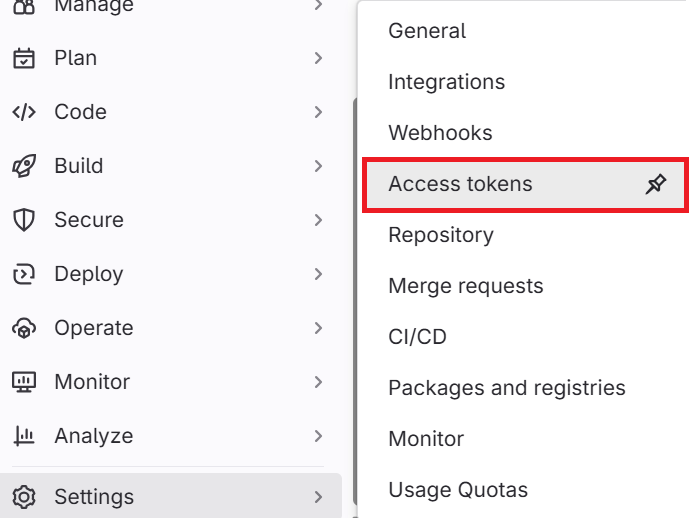

# 📚 포팅 메뉴얼

## 🛠️ 1. 사용 도구

### 협업 도구

| **구분** | **도구** |
| --- | --- |
| 이슈 관리 | Jira |
| 형상 관리 | GitLab, Git |
| 커뮤니케이션 | Notion, Mattermost, Kakao Talk |

### 배포 도구

| **구분** | **도구** |
| --- | --- |
| CI/CD | Jenkins, Docker |
| 클라우드 | AWS EC2 |

### 설계 도구

| **구분** | **도구** |
| --- | --- |
| 와이어프레임 | Figma |
| ERD | dbdiagram.io |
| 문서 작성 | Notion |
| 시스템 아키텍쳐 | cloudcraft |

### 개발 도구

| **구분** | **도구** |
| --- | --- |
| IDE | Visual Studio Code |
| 코드 품질 개선 툴 | SonarQube |
| GPU 서버 | Colab |
| Colab-백엔드 통신 서버 | ngrok + FastAPI |

### AI

| **구분** | **도구** |
| --- | --- |
| 음성 생성 AI(TTS) | CSM-1B |
| 감정파라미터 및 문맥 토크나이제이션 | BERT |
| STT 모델 | whisper API |
| AI 스크립트 생성 | Langchain |
| AI 피드백 생성 | Gemini 2.0 Flash |

## 💻 2. 개발 환경

### Frontend

```json
{
  "name": "frontend",
  "private": true,
  "version": "0.0.0",
  "type": "module",
  "scripts": {
    "dev": "vite",
    "build": "tsc -b && vite build",
    "lint": "eslint .",
    "preview": "vite preview"
  },
  "dependencies": {
    "@reduxjs/toolkit": "^2.6.1",
    "@tanstack/react-query": "^5.67.3",
    "@tanstack/react-query-devtools": "^5.67.3",
    "axios": "^1.8.3",
    "chart.js": "^4.4.8",
    "mic-recorder-to-mp3-fixed": "^2.2.2",
    "react": "^19.0.0",
    "react-chartjs-2": "^5.3.0",
    "react-dom": "^19.0.0",
    "react-ga4": "^2.1.0",
    "react-hotjar": "^6.3.1",
    "react-intersection-observer": "^9.16.0",
    "react-redux": "^9.2.0",
    "react-router-dom": "^7.4.0"
  },
  "devDependencies": {
    "@eslint/js": "^9.21.0",
    "@types/node": "^22.13.10",
    "@types/react": "^19.0.10",
    "@types/react-dom": "^19.0.4",
    "@vitejs/plugin-react": "^4.3.4",
    "eslint": "^9.21.0",
    "eslint-plugin-react-hooks": "^5.1.0",
    "eslint-plugin-react-refresh": "^0.4.19",
    "globals": "^15.15.0",
    "typescript": "~5.7.2",
    "typescript-eslint": "^8.24.1",
    "vite": "^6.2.0",
    "vite-plugin-pwa": "^0.21.1"
  }
}
```

### Backend

| 프로그램 | 버전 |
| --- | --- |
| Python | 3.11.11 |
| AWS SDK (boto3) | 1.37.19 |
| botocore | 1.37.19 |
| FastAPI | 0.115.12 |
| Starlette | 0.46.1 |
| uvicorn | 0.34.0 |
| httpx | 0.28.1 |
| LangChain | 0.3.21 |
| langchain_core | 0.3.48 |
| langchain_google_genai | 2.1.1 |
| langchain_groq | 0.3.1 |
| motor | 3.7.0 |
| PyMongo | 4.11.3 |
| PyJWT | 2.10.1 |
| NumPy | 2.2.4 |
| pandas | 2.2.3 |
| Pydantic | 2.10.6 |
| pydantic_core | 2.27.2 |
| pydantic_settings | 2.8.1 |
| gtts | 2.5.4 |
| pydub | 0.25.1 |
| BeautifulSoup4 | 4.13.3 |
| prometheus_client | 0.21.1 |
| python-multipart | 0.0.7 |
| email-validator | 2.1.0 |
| Locust | 2.33.2 |
| APScheduler | 3.11.0 |
| Redis | 5.2.1 |
| Celery | 5.5.0 |
| Flower | 2.0.1 |
| MongoDB | 6.0.21 |

### Infrastructure

| 구분 | 버전/용도 |
| --- | --- |
| AWS t2.xlarge | CPU: 4 vCPUs, RAM: 16GB, OS: Ubuntu |
| Ubuntu | 22.04.5 LTS |
| Nginx | 1.27.4 |
| Docker | 28.0.1 |
| Jenkins | 2.501 |
| SonarQube | 9.9.8 |
| Prometheus | 2.53.4 |
| Grafana | 11.5.2 |

### 포트 설정

#### 현재 포트 상태 확인

```bash
sudo ufw status
```

결과 예시:
```
Status: active

To                         Action      From
--                         ------      ----
22                         ALLOW       Anywhere                  
80                         ALLOW       Anywhere                  
443                        ALLOW       Anywhere 
8000                       ALLOW       Anywhere
8080                       ALLOW       Anywhere
3000                       ALLOW       Anywhere
...                        ...         ...
```

#### 포트 활성화/비활성화

```bash
# UFW 활성화
sudo ufw enable

# 특정 포트 열기
sudo ufw allow 8080    # 8080 포트 개방
sudo ufw allow 80      # HTTP 포트
sudo ufw allow 443     # HTTPS 포트

# 특정 포트 차단
sudo ufw deny 8080     # 8080 포트 차단
sudo ufw delete allow 8080  # 기존 허용 규칙 삭제
```

#### 프로젝트에 사용한 포트 번호

| 구분 | EC2 | Docker |
| --- | --- | --- |
| SSH 접속 | 22 | 22 |
| HTTP 접속 | 80 | 80 |
| HTTPS 접속 | 443 | 443 |
| Nginx | 80, 443 | 80, 443 |
| React | 80 | 80 |
| Grafana | 3000 | 3000 |
| Flower | 5555 | 5555 |
| Redis | 6379 | 6379 |
| FastAPI | 8000 | 8000 |
| SonarQube | 9005 | 9000 |
| Prometheus | 9090 | 9090 |
| Gerrit | 8989 | 8989 |
| Jenkins | 8080, 50000 | 8080, 50000 |
| Portainer | 9000, 50001 | 9000, 50000 |

## ⚙️ 3. 환경 변수 설정

### Backend

```bash
MONGODB_URI=

# Google Login
GOOGLE_CLIENT_ID=
GOOGLE_CLIENT_SECRET=
GOOGLE_SCOPE=

# GitHub Login
GITHUB_CLIENT_ID=
GITHUB_CLIENT_SECRET=
GITHUB_SCOPE=

GOOGLE_REDIRECT_URI=
GITHUB_REDIRECT_URI=

# jwt config
JWT_SECRET=
# AccessToken
JWT_ACCESS_TOKEN_VALIDITY_IN_SECONDS=
# RefreshToken
JWT_REFRESH_TOKEN_VALIDITY_IN_SECONDS=

# development frontend url
APP_FRONTEND_URL=
```

### Frontend

```bash
NEXT_PUBLIC_API_URL=
```

## 🚀 4. 배포 가이드

### 4.1 서버 세팅

#### 서버 기본 설정

```bash
# 패키지 업데이트
sudo apt update
sudo apt upgrade
```

#### Docker 설치(EC2/Linux)

```bash
# 의존성 설치
sudo apt update
sudo apt install ca-certificates curl gnupg lsb-release

# 레포지토리
sudo mkdir -p /etc/apt/keyrings
sudo curl -fsSL https://download.docker.com/linux/debian/gpg | sudo gpg --dearmor -o /etc/apt/keyrings/docker.gpg

# 레포지토리 추가
echo "deb [arch=$(dpkg --print-architecture) \
signed-by=/etc/apt/keyrings/docker.gpg] https://download.docker.com/linux/ubuntu \
$(. /etc/os-release && echo "$VERSION_CODENAME") stable" | sudo tee /etc/apt/sources.list.d/docker.list > /dev/null

# 도커 설치하기
sudo apt update
sudo apt install docker-ce docker-ce-cli containerd.io docker-compose-plugin
```

#### Dockerfile 생성

##### Backend/Dockerfile

```dockerfile
FROM python:3.11-slim

WORKDIR /app

# 필요한 시스템 패키지 설치 (Git, ffmpeg, Python 개발 패키지, ALSA 포함)
RUN apt-get update && \
    apt-get install -y --no-install-recommends \
    git \
    ffmpeg \
    python3-dev \
    libasound2-dev && \
    apt-get clean && \
    rm -rf /var/lib/apt/lists/*

# 종속성 파일 복사(캐싱을 위해 먼저 복사)
COPY requirements.txt .

# pip 업그레이드 후 의존성 설치 (안정성 향상을 위해)
RUN pip install --upgrade pip && \
    pip install --no-cache-dir-r requirements.txt 

# 애플리케이션 코드 복사
COPY . .

# 실행 설정
EXPOSE 8080
CMD ["uvicorn", "main:app", "--host", "0.0.0.0", "--port", "8000"]
```

##### Frontend/Dockerfile

```dockerfile
FROM node:22-alpine AS build

WORKDIR /app

# 패키지 파일 먼저 복사
COPY package.json package-lock.json ./

# 의존성 설치
RUN npm ci

# 코드 복사
COPY . .

RUN npm run build

CMD ["/bin/sh", "-c", "cp -r dist/* /usr/share/nginx/html/ && tail -f /dev/null"]
```

##### nginx/Dockerfile

```dockerfile
FROM nginx:alpine

COPY conf.d/default.conf /etc/nginx/conf.d/default.conf

EXPOSE 80 443
CMD ["nginx", "-g", "daemon off;"]
```

### 4.2 Jenkins 설정

#### Jenkins 컨테이너 생성

```bash
docker run --name jenkins -d \
-p 8080:8080 -p 50000:50000 \
-v /home/ubuntu/jenkins:/var/jenkins_home \
-v /var/run/docker.sock:/var/run/docker.sock \
jenkins/jenkins:lts
```

#### Jenkins 버전 최신화

```bash
# 로컬 터미널에서 실행
scp -i I12B107T.pem jenkins.war ubuntu@i12b107.p.ssafy.io:/home/ubuntu/

# EC2 터미널에서 실행
sudo docker cp /home/ubuntu/jenkins.war jenkins:/usr/share/jenkins/jenkins.war

# 권한 설정 및 재시작
sudo docker exec jenkins chown jenkins:jenkins /usr/share/jenkins/jenkins.war
sudo docker restart jenkins

# docker jenkins 컨테이너 실행
sudo docker start jenkins

# docker 컨테이너 실행 로그 확인
sudo docker logs jenkins
```

#### Jenkins 전용 docker-compose.yml 파일 생성

```yaml
services:
  jenkins:
    image: jenkins/jenkins:2.501
    container_name: jenkins
    user: root
    privileged: true
    ports:
      - "8080:8080"
      - "50000:50000"
    volumes:
      - ./jenkins_home:/var/jenkins_home
      - /var/run/docker.sock:/var/run/docker.sock
      - /usr/bin/docker:/usr/bin/docker
    environment:
      - TZ=Asia/Seoul
    restart: always
```

#### Pipeline 설정
- Jenkins 파이프라인 생성
  
  

  

  

  
----------------------------------------------
- GitLab Webhook 설정


- URL에 Jenkins 파이프라인 주소를 매핑


- Jenkins의 secretToken을 webhook에 설정

- Jenkins - Configure - Trigger - Build when a change.. - 고급 클릭


- Test events 눌러서 webhook 연동 확인


- Merge Requrest events는 Jenkins에 바로 적용 안되는 경우가 많음 -> Test를 위해서 Push event로 설정하고 테스트
------------------------------------------------
- 환경변수 설정

- Jenkins 관리 - Security - Credentials 클릭


- global - Add credentials 클릭


- gitlab accessToken Jenkins에 등록 (gitlab settings에서 access tokens 클릭)



- Add new token 클릭


- token name과 role 설정(Maintainer or Developer)


- scope 설정 및 토큰 생성


- 생성된 토큰 번호 확인 및 저장 (확인 기회 1번뿐! 반드시 저장할 것)


- gitlab token을 jenkins에 등록


- Kind: GitLab API token
- API token: gitlab에서 발급받은 token 기입
- ID: Jenkins에서 사용할 토큰 이름
- Create 클릭!
-------------------------------------------------------  
- gitlab 유저 등록 
  

  - Kind: Username with password
  - Username: Gitlab ID
  - Password: Gitlab Password
  - ID: Jenkins 환경변수로 쓸 이름 ex. gitlab-user-pwd
  - Create 클릭!
--------------------------------------------------------

#### Jenkins 파이프라인 코드
- Jenkinsfile.ci
```Jenkinsfile
pipeline {
    agent any

    environment {
        DOCKERHUB_CREDENTIALS = credentials('dockerhub-credentials')
        DOCKER_REGISTRY = "kst1040"
        BACKEND_IMAGE = "${DOCKER_REGISTRY}/omypic-backend"
        FRONTEND_IMAGE = "${DOCKER_REGISTRY}/omypic-frontend"
        
        GIT_COMMIT_SHORT = sh(
            script: "printf \$(git rev-parse --short HEAD)",
            returnStdout: true
        )

        GIT_AUTHOR_ID = "${env.gitlabUserName}"
        GIT_AUTHOR_EMAIL = "${env.gitlabUserEmail ?: 'Not set'}"
    }

    stages {
        stage('Checkout') {
            steps {
                checkout([
                    $class: 'GitSCM',
                    branches: [[name: "dev"]],
                    userRemoteConfigs: [[url: 'https://lab.ssafy.com/s12-ai-speech-sub1/S12P21B107.git', credentialsId: 'gitlab-user-pwd']]
                ])
            }
        }

        stage('Check Target Branch') {
            steps {
                script {
                    if (env.gitlabTargetBranch != 'dev' && !env.GIT_BRANCH.endsWith('dev')) {
                        error("This pipeline only runs for pushes targeting the dev branch")
                    }
                }
            }
        }

        stage('Prepare Frontend Environment') {
            when { changeset "Frontend/**" }
            steps {
                withCredentials([
                    string(credentialsId: 'vite-api-url', variable: 'VITE_API_URL'),
                    string(credentialsId: 'vite-ga-tracking-id', variable: 'VITE_GA_TRACKING_ID'),
                    string(credentialsId: 'vite-hotjar-id', variable: 'VITE_HOTJAR_ID'),
                ]) {
                    sh '''
                        cd Frontend
                        cp .env.production.template .env
                        sed -i "s|VITE_API_URL=|VITE_API_URL=${VITE_API_URL}|g" .env
                        sed -i "s|VITE_GA_TRACKING_ID=|VITE_GA_TRACKING_ID=${VITE_GA_TRACKING_ID}|g" .env
                        sed -i "s|VITE_HOTJAR_ID=|VITE_HOTJAR_ID=${VITE_HOTJAR_ID}|g" .env
                    '''
                }
            }
        }

        stage('Build & Push Images') {
            parallel {
                stage('Backend') {
                    when { changeset "Backend/**" }
                    steps {
                        script {
                            buildAndPushImage("${BACKEND_IMAGE}", "./Backend")
                        }
                    }
                }

                stage('Frontend') {
                    when { changeset "Frontend/**" }
                    steps {
                        script {
                            buildAndPushImage("${FRONTEND_IMAGE}", "./Frontend")
                        }
                    }
                }
            }
        }
    }

    post {
        success {
            script {
                mattermostSend(
                    color: 'good', 
                    message: "빌드 성공: ${env.JOB_NAME} #${env.BUILD_NUMBER} by ${env.GIT_AUTHOR_ID}(${env.GIT_AUTHOR_EMAIL})\n(<${env.BUILD_URL}|Details>)",
                    endpoint: 'https://meeting.ssafy.com/hooks/gd11st38kbd1znej9kh3ftbg6o',
                    channel: 'B107-Jenkins'
                )
            }
            echo 'CI Pipeline succeeded! Images have been built and pushed to Docker Hub.'
        }
        failure {
            script {
                mattermostSend(
                    color: 'danger', 
                    message: "빌드 실패: ${env.JOB_NAME} #${env.BUILD_NUMBER} by ${env.GIT_AUTHOR_ID}(${env.GIT_AUTHOR_EMAIL})\n(<${env.BUILD_URL}|Details>)",
                    endpoint: 'https://meeting.ssafy.com/hooks/gd11st38kbd1znej9kh3ftbg6o',
                    channel: 'B107-Jenkins'
                )
            }
            echo 'CI Pipeline failed! Check the logs for details.'
        }
        always {
            sh 'docker image prune -f'
            cleanWs()
        }
    }
}

def buildAndPushImage(String imageName, String context) {
    docker.withRegistry('https://index.docker.io/v1/', 'dockerhub-credentials') {
        sh """
            docker build -t ${imageName}:${GIT_COMMIT_SHORT} -t ${imageName}:latest ${context}
            docker push ${imageName}:${GIT_COMMIT_SHORT}
            docker push ${imageName}:latest
        """
    }
}
```

- Jenkinsfile.cd
```Jenkinsfile
def sshCommand(command) {
    withCredentials([sshUserPrivateKey(credentialsId: 'ec2-ssh-key', keyFileVariable: 'SSH_KEY')]) {
        return sh(
            script: "ssh -i \$SSH_KEY -o StrictHostKeyChecking=no \$EC2_USER@\$EC2_HOST '${command}'",
            returnStdout: true
        ).trim()
    }
}

pipeline {
    agent any
    environment {
        EC2_HOST = credentials('EC2_SERVER_IP')
        EC2_USER = 'ubuntu'
        DEPLOY_DIR = '/home/ubuntu/OmyPIC'
        DOCKER_REGISTRY = "kst1040"
        BACKEND_IMAGE = "${DOCKER_REGISTRY}/omypic-backend"
        FRONTEND_IMAGE = "${DOCKER_REGISTRY}/omypic-frontend"
        DEPLOYMENT_SUCCESS = 'false'
    }
    
    stages {
        stage('Check MR Target') {
            steps {
                script {
                    if(env.gitlabTargetBranch != 'dev') {
                        error("This pipeline only runs for MRs targeting the dev branch")
                    }
                }
            }
        }
        
        stage('Determine Target Environment') {
            steps {
                script {
                    // 스크립트 실행 권한 부여
                    sshCommand("cd ${DEPLOY_DIR} && chmod +x health-check.sh switch-script.sh")
                    
                    // 현재 환경 확인
                    def checkCmd = "cd ${DEPLOY_DIR}/nginx/conf.d && cat upstream.conf | grep -q 'blue' && echo 'blue' || echo 'green'"
                    def currentEnv = sshCommand(checkCmd)
                    def targetEnv = (currentEnv == "blue") ? "green" : "blue"
                    
                    // 환경 변수에 값 설정
                    env.CURRENT_ENV = currentEnv
                    env.TARGET_ENV = targetEnv
                    
                    echo "현재 활성 환경: ${env.CURRENT_ENV}, 배포 타겟 환경: ${env.TARGET_ENV}"
                }
            }
        }
        
        stage('Deploy to Target') {
            steps {
                script {
                    sshCommand("""
                        cd ${DEPLOY_DIR}
                        docker image pull ${BACKEND_IMAGE}:latest
                        docker image pull ${FRONTEND_IMAGE}:latest
                        docker compose -p omypic-${env.TARGET_ENV} -f docker-compose-${env.TARGET_ENV}.yml up -d
                    """)
                }
            }
        }
        
        stage('Health Check') {
            steps {
                script {
                    echo "배포 환경이 안정화될 때까지 30초 대기 중..."
                    sleep(time: 30, unit: 'SECONDS')
            
                    // 컨테이너 상태 확인
                    def containerStatus = sshCommand("cd ${DEPLOY_DIR} && docker ps | grep omypic-${env.TARGET_ENV}")
                    echo "컨테이너 상태: ${containerStatus}"
            
                    // health-check.sh 출력 내용 확인
                    def healthOutput = sshCommand("cd ${DEPLOY_DIR} && ./health-check.sh ${env.TARGET_ENV}")
                    echo "헬스 체크 출력: ${healthOutput}"
            
                    // 종료 코드 확인
                    def healthStatus = sshCommand("cd ${DEPLOY_DIR} && ./health-check.sh ${env.TARGET_ENV} >/dev/null 2>&1; echo \$?")
                    echo "헬스 체크 상태 코드: ${healthStatus}"
            
                    if (healthStatus.trim() == "0") {
                        echo "헬스 체크 성공: 대상 환경(${env.TARGET_ENV})이 정상 작동합니다."  
                    } else {
                        error "대상 환경(${env.TARGET_ENV})의 헬스 체크가 실패했습니다. 트래픽 전환을 취소합니다."
                    }
                }
            }
        }
        
        stage('Switch Traffic') {
            steps {
                script {
                    // sshCommand 헬퍼 대신 표준 sh 단계 사용
                    withCredentials([sshUserPrivateKey(credentialsId: 'ec2-ssh-key', keyFileVariable: 'SSH_KEY')]) {
                        // 스크립트 마지막의 '; echo $?' 제거
                        // sh 단계가 ssh 명령어의 종료 코드를 직접 확인하여 실패 처리함
                        sh "ssh -i \$SSH_KEY -o StrictHostKeyChecking=no \$EC2_USER@\$EC2_HOST 'cd ${DEPLOY_DIR} && CURRENT_ENV=${env.CURRENT_ENV} TARGET_ENV=${env.TARGET_ENV} ./switch-script.sh'"
                    }
                    // 위 sh 단계가 성공적으로 완료되면 (스크립트가 exit 0으로 종료되면) 아래 라인 실행
                    echo "트래픽 전환 성공: ${env.TARGET_ENV} 환경으로 전환 완료"
                    env.DEPLOYMENT_SUCCESS = 'true'
                    // sh 단계 실패 시 자동으로 에러가 발생하고 post { failure } 블록으로 넘어감
                }
            }
        }
        
        stage('Cleanup') {
            steps {
                sshCommand("docker image prune -f")
            }
        }
        
        stage('Update MR Status') {
            steps {
                updateGitlabCommitStatus name: 'build', state: 'success'
                addGitLabMRComment comment: "📦 배포 완료: ${env.BUILD_URL}\n- 환경: ${env.TARGET_ENV}"
            }
        }
    }
    
    post {
        success {
            echo "배포 성공: ${env.TARGET_ENV} 환경으로 전환 완료"
            updateGitlabCommitStatus name: 'build', state: 'success'
        }
        
        failure {
            echo "배포 실패: 문제 발생"
            updateGitlabCommitStatus name: 'build', state: 'failed'
            
            script {
                // 안전하게 변수 확인
                if (env.TARGET_ENV && env.DEPLOYMENT_SUCCESS != 'true') {
                    echo "새로 배포된 ${env.TARGET_ENV} 환경에 문제가 발생했습니다."
                    
                    // 트래픽 전환 전에 실패한 경우만 대상 환경 컨테이너 정리
                    sshCommand("cd ${DEPLOY_DIR} && docker compose -p omypic-${env.TARGET_ENV} -f docker-compose-${env.TARGET_ENV}.yml down --remove-orphans || echo '실패한 대상 환경(${env.TARGET_ENV}) 정리에 실패했거나 이미 중지됨'")
                    echo "${env.TARGET_ENV} 환경(${env.TARGET_PROJECT})을 중지/정리했습니다." // 로그 메시지도 명확하게
                }
                
                addGitLabMRComment comment: "❌ 배포 실패: ${env.BUILD_URL}\n원인을 확인하세요."
            }
        }
        
        always {
            cleanWs()
        }
    }
}
```

#### shell scripts
- init-volumes.sh
```bash
#!/bin/bash
# Docker 볼륨 초기화 스크립트

echo "===== Docker 볼륨 초기화 시작 ====="

# 1. 필요한 Docker 볼륨 생성
echo "Docker 볼륨 생성 중..."

# 네트워크 확인 및 생성
if ! docker network ls | grep -q omypic-network; then
    echo "omypic-network 생성 중..."
    docker network create omypic-network
    echo "omypic-network 생성 완료"
else
    echo "omypic-network가 이미 존재합니다."
fi

# 프론트엔드 볼륨 확인 및 생성
if ! docker volume ls | grep -q frontend-blue-build; then
    echo "frontend-blue-build 볼륨 생성 중..."
    docker volume create frontend-blue-build
    echo "frontend-blue-build 볼륨 생성 완료"
else
    echo "frontend-blue-build 볼륨이 이미 존재합니다."
fi

if ! docker volume ls | grep -q frontend-green-build; then
    echo "frontend-green-build 볼륨 생성 중..."
    docker volume create frontend-green-build
    echo "frontend-green-build 볼륨 생성 완료"
else
    echo "frontend-green-build 볼륨이 이미 존재합니다."
fi

# 2. 디렉토리 구조 생성
echo "디렉토리 구조 생성 중..."

# nginx 설정 디렉토리
mkdir -p nginx/conf.d
mkdir -p certbot/conf
mkdir -p certbot/www

echo "디렉토리 구조 생성 완료"

# 3. Docker Compose 파일 존재 확인
echo "Docker Compose 파일 확인 중..."

required_files=(
    "docker-compose-nginx.yml"
    "docker-compose-blue.yml"
    "docker-compose-green.yml"
    "nginx/conf.d/default.conf"
    "nginx/conf.d/upstream.conf"
)

for file in "${required_files[@]}"; do
    if [ ! -f "$file" ]; then
        echo "Warning: $file 파일이 존재하지 않습니다."
    fi
done

echo "===== Docker 볼륨 초기화 완료 ====="
echo "이제 다음 명령어로 Nginx를 시작할 수 있습니다:"
echo "docker-compose -f docker-compose-nginx.yml up -d"
echo ""
echo "그 후 nginx-setup-script.sh를 실행하여 Nginx 설정을 완료하세요."
```

- nginx-setup-script.sh
```bash
#!/bin/bash
# Nginx 블루-그린 초기 설정 스크립트
# Jenkins에서 첫 배포 전에 한 번 실행해야 함

# 현재 디렉토리를 기본값으로 설정, Jenkins에서는 WORKSPACE 변수 사용
if [ -z "${WORKSPACE}" ]; then
    WORKSPACE_PATH="$(pwd)"
else
    WORKSPACE_PATH="${WORKSPACE}"
fi

NGINX_CONF_PATH="${WORKSPACE_PATH}/nginx/conf.d"

echo "===== Nginx 블루-그린 초기 설정 시작 ====="

# 1. 볼륨 생성 확인
echo "볼륨 생성 확인 중..."
docker volume inspect frontend-blue-build >/dev/null 2>&1 || docker volume create frontend-blue-build
docker volume inspect frontend-green-build >/dev/null 2>&1 || docker volume create frontend-green-build
echo "볼륨 생성 완료"

# 2. upstream.conf 파일 생성/수정
echo "upstream.conf 파일 생성 중..."
mkdir -p ${NGINX_CONF_PATH}
cat > ${NGINX_CONF_PATH}/upstream.conf << EOF
upstream backend {
    server omypic-blue-backend:8000;
}
EOF
echo "upstream.conf 파일 생성 완료"

# 3. default.conf 수정 - root 경로를 current로 변경
echo "default.conf 파일 수정 중..."
if [ -f "${NGINX_CONF_PATH}/default.conf" ]; then
    sed -i 's|root /usr/share/nginx/html;|root /usr/share/nginx/current;|g' ${NGINX_CONF_PATH}/default.conf
    echo "default.conf 파일 수정 완료"
else
    echo "Error: default.conf 파일이 존재하지 않습니다. 먼저 Nginx 설정 파일을 생성하세요."
    exit 1
fi

# 4. Nginx 컨테이너가 실행 중인지 확인
echo "Nginx 컨테이너 상태 확인 중..."
if ! docker ps | grep -q omypic-nginx; then
    echo "Error: omypic-nginx 컨테이너가 실행 중이 아닙니다. 먼저 Nginx 컨테이너를 시작하세요."
    exit 1
fi

# 5. Nginx 컨테이너에 디렉토리 및 심볼릭 링크 생성
echo "Nginx 컨테이너에 디렉토리 및 심볼릭 링크 생성 중..."
docker exec omypic-nginx sh -c 'mkdir -p /usr/share/nginx/blue /usr/share/nginx/green'
docker exec omypic-nginx sh -c 'ln -sfn /usr/share/nginx/blue /usr/share/nginx/current'
echo "디렉토리 및 심볼릭 링크 생성 완료"

# 6. Nginx 설정 리로드
echo "Nginx 설정 리로드 중..."
docker exec omypic-nginx nginx -s reload
echo "Nginx 설정 리로드 완료"

echo "===== Nginx 블루-그린 초기 설정 완료 ====="
echo "기본 환경: blue"
echo "이제 Jenkins 파이프라인을 실행하여 애플리케이션을 배포할 수 있습니다."
```

- health-check.sh
```bash
#!/bin/bash
# 개선된 컨테이너 상태 확인 스크립트 (레이블 기반, 애플리케이션 헬스 체크 제외)
echo "===== health-check.sh 실행 ====="
set -e # 스크립트 실행 중 오류 발생 시 즉시 중단

# 환경 변수 설정 (인자 $1)
TARGET=$1 # "blue" 또는 "green"

# 입력값 검증
if [ "$TARGET" != "blue" ] && [ "$TARGET" != "green" ]; then
  echo "[Error] 유효하지 않은 환경입니다: ${TARGET}. 'blue' 또는 'green'만 가능합니다." >&2
  echo "사용법: $0 [blue|green]" >&2
  exit 1
fi

TARGET_PROJECT="omypic-${TARGET}"
BACKEND_SERVICE="backend"    # docker-compose-*.yml 파일 내의 백엔드 서비스 이름
FRONTEND_SERVICE="frontend"  # docker-compose-*.yml 파일 내의 프론트엔드 서비스 이름

echo "[Info] ===== ${TARGET_PROJECT} 환경 상태 확인 시작 ====="
echo "[Debug] Docker 컨테이너 목록 (관련 프로젝트):"
# 필터링하여 관련 프로젝트 컨테이너만 표시
docker ps -a --filter label=com.docker.compose.project=${TARGET_PROJECT}

# --- 컨테이너 ID 찾기 (레이블 기반) ---
echo "[Info] 컨테이너 ID 검색 중..."

BACKEND_CONTAINER_ID=$(docker ps -q --filter label=com.docker.compose.project=${TARGET_PROJECT} --filter label=com.docker.compose.service=${BACKEND_SERVICE})
FRONTEND_CONTAINER_ID=$(docker ps -q --filter label=com.docker.compose.project=${TARGET_PROJECT} --filter label=com.docker.compose.service=${FRONTEND_SERVICE})

# 컨테이너 ID 존재 여부 확인
if [ -z "$BACKEND_CONTAINER_ID" ]; then
  echo "[Error] ${TARGET_PROJECT} 프로젝트의 ${BACKEND_SERVICE} 서비스 컨테이너를 찾을 수 없습니다." >&2
  exit 1
fi
if [ -z "$FRONTEND_CONTAINER_ID" ]; then
  echo "[Error] ${TARGET_PROJECT} 프로젝트의 ${FRONTEND_SERVICE} 서비스 컨테이너를 찾을 수 없습니다." >&2
  exit 1
fi

echo "[Debug] 찾은 백엔드 컨테이너 ID: ${BACKEND_CONTAINER_ID}"
echo "[Debug] 찾은 프론트엔드 컨테이너 ID: ${FRONTEND_CONTAINER_ID}"

# --- 컨테이너 상태 확인 (docker inspect) ---
echo "[Info] 컨테이너 실행 상태 확인 중..."

# 백엔드 상태 확인
BACKEND_STATUS=$(docker inspect --format='{{.State.Status}}' $BACKEND_CONTAINER_ID 2>/dev/null)
BACKEND_RUNNING=$(docker inspect --format='{{.State.Running}}' $BACKEND_CONTAINER_ID 2>/dev/null)
echo "[Debug] 백엔드 상태: ${BACKEND_STATUS}, 실행 중: ${BACKEND_RUNNING}"

if [ "$BACKEND_STATUS" != "running" ] || [ "$BACKEND_RUNNING" != "true" ]; then
  echo "[Error] 백엔드 컨테이너(${BACKEND_CONTAINER_ID})가 'running' 상태가 아닙니다." >&2
  exit 1
fi

# 프론트엔드 상태 확인
FRONTEND_STATUS=$(docker inspect --format='{{.State.Status}}' $FRONTEND_CONTAINER_ID 2>/dev/null)
FRONTEND_RUNNING=$(docker inspect --format='{{.State.Running}}' $FRONTEND_CONTAINER_ID 2>/dev/null)
echo "[Debug] 프론트엔드 상태: ${FRONTEND_STATUS}, 실행 중: ${FRONTEND_RUNNING}"

if [ "$FRONTEND_STATUS" != "running" ] || [ "$FRONTEND_RUNNING" != "true" ]; then
  echo "[Error] 프론트엔드 컨테이너(${FRONTEND_CONTAINER_ID})가 'running' 상태가 아닙니다." >&2
  exit 1
fi

# --- 최종 결과 ---
echo "[Success] ===== 상태 확인 결과: 성공 ====="
echo "모든 컨테이너(${TARGET_PROJECT})가 정상적으로 실행 중입니다."
exit 0
```

- switch-script.sh
```bash
#!/bin/bash
# 단순화된 블루-그린 환경 트래픽 전환 스크립트
set -x # ===========> 실행되는 모든 명령어 출력
# 현재 디렉토리를 기본값으로 설정, Jenkins에서는 WORKSPACE 변수 사용
if [ -z "${WORKSPACE}" ]; then
    WORKSPACE_PATH="$(pwd)"
else
    WORKSPACE_PATH="${WORKSPACE}"
fi

NGINX_CONF_PATH="${WORKSPACE_PATH}/nginx/conf.d"

# ====> 디버깅용 echo 추가 <====
echo "### DEBUG: 스크립트 시작 ###"
echo "### DEBUG: 전달받은 CURRENT_ENV=${CURRENT_ENV}"
echo "### DEBUG: 전달받은 TARGET_ENV=${TARGET_ENV}"
echo "### DEBUG: WORKSPACE_PATH=${WORKSPACE_PATH}"
echo "### DEBUG: NGINX_CONF_PATH=${NGINX_CONF_PATH}"
echo "===== 블루-그린 배포 시작 ====="

# 환경 변수 확인 (Jenkins에서 전달받은 환경변수 사용)
echo "Jenkins에서 전달된 환경 변수: CURRENT_ENV=${CURRENT_ENV}, TARGET_ENV=${TARGET_ENV}"

# 값 검증
if [ -z "${CURRENT_ENV}" ] || [ -z "${TARGET_ENV}" ]; then
    echo "Error: CURRENT_ENV 또는 TARGET_ENV가 설정되지 않았습니다."
    exit 1
fi

if [ "${CURRENT_ENV}" != "blue" ] && [ "${CURRENT_ENV}" != "green" ]; then
    echo "Error: CURRENT_ENV는 'blue' 또는 'green'이어야 합니다."
    exit 1
fi

if [ "${TARGET_ENV}" != "blue" ] && [ "${TARGET_ENV}" != "green" ]; then
    echo "Error: TARGET_ENV는 'blue' 또는 'green'이어야 합니다."
    exit 1
fi

echo "배포 계획: 현재 활성 환경(${CURRENT_ENV}) → 대상 환경(${TARGET_ENV})"

# 대상 환경 컨테이너가 실행 중인지 확인
if ! docker ps | grep -q "omypic-${TARGET_ENV}-backend"; then
    echo "Error: 대상 환경 컨테이너가 실행 중이 아닙니다. 먼저 컨테이너를 시작하세요."
    exit 1
fi

# 컨테이너 상태 확인
BACKEND_STATUS=$(docker inspect --format='{{.State.Status}}' omypic-${TARGET_ENV}-backend 2>/dev/null || echo "not_found")
FRONTEND_STATUS=$(docker inspect --format='{{.State.Status}}' omypic-${TARGET_ENV}-frontend 2>/dev/null || echo "not_found")

if [ "$BACKEND_STATUS" != "running" ] || [ "$FRONTEND_STATUS" != "running" ]; then
    echo "Error: 대상 환경의 컨테이너가 정상적으로 실행되지 않았습니다."
    echo "Backend 상태: ${BACKEND_STATUS}, Frontend 상태: ${FRONTEND_STATUS}"
    echo "이전 환경(${CURRENT_ENV})이 계속 사용됩니다."
    exit 1
fi

echo "컨테이너 상태 확인 완료: 대상 환경(${TARGET_ENV})이 정상적으로 실행 중입니다."

# 트래픽 전환 (upstream.conf 수정)
echo "트래픽 전환 중..."

# upstream.conf 파일 백업
cp ${NGINX_CONF_PATH}/upstream.conf ${NGINX_CONF_PATH}/upstream.conf.bak

# 기존 upstream.conf 파일 내용 교체
cat > ${NGINX_CONF_PATH}/upstream.conf << EOF
upstream backend {
    server omypic-${TARGET_ENV}-backend:8000;  # active
}
EOF

echo "upstream.conf 파일 업데이트 완료"

# 프론트엔드 전환 (심볼릭 링크 업데이트)
echo "프론트엔드 심볼릭 링크 업데이트 중..."
docker exec omypic-nginx sh -c "ln -sfn /usr/share/nginx/${TARGET_ENV} /usr/share/nginx/current"
echo "프론트엔드 심볼릭 링크 업데이트 완료"

# Nginx 설정 리로드
echo "Nginx 설정 리로드 중..."
if ! docker exec omypic-nginx nginx -t; then
    echo "Error: Nginx 설정 파일에 구문 오류가 있습니다. 트래픽 전환이 취소됩니다."
    # 백업에서 복원
    cp ${NGINX_CONF_PATH}/upstream.conf.bak ${NGINX_CONF_PATH}/upstream.conf
    docker exec omypic-nginx sh -c "ln -sfn /usr/share/nginx/${CURRENT_ENV} /usr/share/nginx/current"
    exit 1
fi

docker exec omypic-nginx nginx -s reload
echo "Nginx 설정 리로드 완료"

# 트래픽 전환 성공 확인 및 이전 환경 중지
echo "===== 트래픽 전환 완료 ====="
echo "트래픽이 ${CURRENT_ENV} → ${TARGET_ENV} 환경으로 성공적으로 전환되었습니다."
echo "이전 환경(${CURRENT_ENV}) 중지 중..."

# ====> 디버깅용 echo 추가 <====
echo "### DEBUG: 이전 환경 중지 로직 시작 (CURRENT_ENV=${CURRENT_ENV}) ###"

CURRENT_PROJECT_NAME="omypic-${CURRENT_ENV}" # 명시적으로 프로젝트 이름 사용

# 이전 환경 중지 - 명시적으로 환경 확인 후 중지
echo "### DEBUG: 이전 프로젝트 (${CURRENT_PROJECT_NAME}) 중지 시도 ###"
cd ${WORKSPACE_PATH} && docker compose -p "${CURRENT_PROJECT_NAME}" -f "docker-compose-${CURRENT_ENV}.yml" down --remove-orphans

DOWN_EXIT_CODE=$?
echo "### DEBUG: ${CURRENT_PROJECT_NAME} 중지 명령 후 종료 코드: ${DOWN_EXIT_CODE} ###"

# 종료 코드 확인 및 로그 (선택적이지만 권장)
if [ $DOWN_EXIT_CODE -ne 0 ]; then
    echo "경고: 이전 환경(${CURRENT_PROJECT_NAME}) 중지에 실패했습니다 (종료 코드: ${DOWN_EXIT_CODE}). 이미 중지되었거나 다른 문제가 있을 수 있습니다. 수동 확인이 필요할 수 있습니다."
    # 실패해도 스크립트는 성공(exit 0)으로 간주할 수 있음 (트래픽 전환은 성공했으므로)
else
    echo "이전 환경(${CURRENT_PROJECT_NAME}) 중지 완료"
fi

echo "블루-그린 배포가 성공적으로 완료되었습니다."

# 백업 파일 제거
rm ${NGINX_CONF_PATH}/upstream.conf.bak

echo "### DEBUG: 스크립트 정상 종료 직전 ###" # 추가
exit 0
```

### 4.3 Nginx 설정

#### SSL 인증서 발급

```bash
docker exec -it nginx bash
apt-get update
apt-get install certbot python3-certbot-nginx
certbot --nginx -d your-domain.com
```

#### Nginx 설정 파일(nginx/conf.d/default.conf)

```nginx
server {
    listen 80;
    server_name omypic.store www.omypic.store;
    
    # Let's Encrypt 인증 챌린지 경로
    location /.well-known/acme-challenge/ {
        root /var/www/certbot;
    }
    
    # HTTP -> HTTPS 리다이렉트
    location / {
        return 301 https://$host$request_uri;
    }
}

# HTTPS 서버 설정
server {
    listen 443 ssl;
    server_name omypic.store www.omypic.store;
    
    # SSL 인증서 경로
    ssl_certificate /etc/letsencrypt/live/omypic.store/fullchain.pem;
    ssl_certificate_key /etc/letsencrypt/live/omypic.store/privkey.pem;
    
    # SSL 설정 최적화
    ssl_protocols TLSv1.2 TLSv1.3;
    ssl_prefer_server_ciphers on;
    ssl_ciphers HIGH:!aNULL:!MD5;
    ssl_session_timeout 10m;
    ssl_session_cache shared:SSL:10m;
    
    # 프론트엔드 정적 파일 서빙 - current 심볼릭 링크 사용
    location / {
        root /usr/share/nginx/current;  # blue 또는 green을 가리키는 심볼릭 링크
        index index.html;
        try_files $uri $uri/ /index.html;  # SPA를 위한 설정
    }

    # 캐싱 설정
    location ~* \.(js|css|png|jpg|jpeg|gif|ico|svg)$ {
        root /usr/share/nginx/current;
        expires 1y;
        add_header Cache-Control "public, max-age=31536000, immutable";

        # 로깅 최소화로 서버 부하 감소
        access_log off;
        log_not_found off;
    }

    location ~* \.(png|jpg|jpeg)$ {
        root /usr/share/nginx/current;
        add_header Vary Accept;

        # 브라우저가 webP를 지원하고 webP 버전이 존재하면 webP 제공
        if($http_accept ~* "webp") {
            set $webp_exist "${document_root}$uri.webp";
            if(-f $webp_exist) {
                rewrite (.*) $1.webp break;
            }
        }
    }
    # 404 에러 처리
    error_page 404 /index.html;

    # gzip 압축 활성화
    gzip on;
    gzip_types text/plain text/css application/json application/javascript text/xml application/xml+rss text/javascript;
    
    # 백엔드 API 요청 프록시
    location /api/ {
        proxy_pass http://backend;
        proxy_http_version 1.1;
        proxy_set_header Host $host;
        proxy_set_header X-Real-IP $remote_addr;
        proxy_set_header Service-Worker-Allowed "";
        proxy_set_header X-Forwarded-For $proxy_add_x_forwarded_for;
        proxy_set_header X-Forwarded-Proto $scheme;
        proxy_read_timeout 90;
    }
    
    # Swagger UI, ReDoc 등 API 문서 관련 경로
    location ~ ^/(docs|redoc|openapi.json) {
        proxy_pass http://backend/$1;
        proxy_http_version 1.1;
        proxy_set_header Host $host;
        proxy_set_header X-Real-IP $remote_addr;
        proxy_set_header X-Forwarded-For $proxy_add_x_forwarded_for;
        proxy_set_header X-Forwarded-Proto $scheme;
    }
    
    # 에러 페이지
    error_page 500 502 503 504 /50x.html;
    location = /50x.html {
        root /usr/share/nginx/current;
        internal;
    }
}
```

#### Nginx 트래픽 전환 파일(nginx/conf.d/upstream.conf)
```nginx
upstream backend {
    # 초기 버전은 블루 서버에 배포
    server omypic-blue-backend:8000;  # active
}

```

### 4.4 docker-compose.yml 파일 생성

#### docker-compose-nginx.yml (공통 파일)

```yaml
services:
  nginx:
    image: kst1040/omypic-nginx:latest
    container_name: omypic-nginx
    ports:
      - "80:80"
      - "443:443"
    volumes:
      - ./nginx/conf.d/default.conf:/etc/nginx/conf.d/default.conf
      - ./nginx/conf.d/upstream.conf:/etc/nginx/conf.d/upstream.conf
      - ./certbot/conf:/etc/letsencrypt
      - ./certbot/www:/var/www/certbot
      - frontend-blue-build:/usr/share/nginx/blue
      - frontend-green-build:/usr/share/nginx/green
    networks:
      - omypic-network
    restart: unless-stopped
    
  certbot:
    image: certbot/certbot
    container_name: omypic-certbot
    volumes:
      - ./certbot/conf:/etc/letsencrypt
      - ./certbot/www:/var/www/certbot
    entrypoint: "/bin/sh -c 'trap exit TERM; while :; do certbot renew; sleep 12h & wait $${!}; done;'"
    networks:
      - omypic-network
    restart: unless-stopped

volumes:
  frontend-blue-build:
    external: true
  frontend-green-build:
    external: true

networks:
  omypic-network:
    external: true
```

#### docker-compose-blue.yml (블루 서버)

```yaml
services:
  frontend:
    image: kst1040/omypic-frontend:latest
    container_name: omypic-blue-frontend
    env_file:
      - .env
    volumes:
      - type: volume
        source: frontend-blue-build
        target: /usr/share/nginx/blue
    command: ["sh", "-c", "cp -r /app/dist/* /usr/share/nginx/blue/ && echo 'Files copied to blue volume' && tail -f /dev/null"]
    networks:
      - omypic-network

  backend:
    image: kst1040/omypic-backend:latest
    container_name: omypic-blue-backend
    env_file:
      - .env
    expose:
      - 8000
    networks:
      - omypic-network

networks:
  omypic-network:
    external: true

volumes:
  frontend-blue-build:
    external: true
```

#### docker-compose-green.yml (그린 서버)

```yaml
services:
  frontend:
    image: kst1040/omypic-frontend:latest
    container_name: omypic-green-frontend
    env_file:
      - .env
    volumes:
      - frontend-green-build:/usr/share/nginx/green
    command: ["sh", "-c", "cp -r /app/dist/* /usr/share/nginx/green/ && echo 'Files copied to green volume' && tail -f /dev/null"]
    networks:
      - omypic-network

  backend:
    image: kst1040/omypic-backend:latest
    container_name: omypic-green-backend
    env_file:
      - .env
    expose:
      - 8000
    networks:
      - omypic-network
      
networks:
  omypic-network:
    external: true
    
volumes:
  frontend-green-build:
    external: true
```

#### jenkins-compose.yml (Jenkins-Prometheus-Grafana)

```yaml
services:
  jenkins:
    image: jenkins/jenkins:2.501
    container_name: jenkins
    user: root
    privileged: true
    ports:
      - "8080:8080"
      - "50001:50000"
    volumes:
      - jenkins_home:/var/jenkins_home
      - /var/run/docker.sock:/var/run/docker.sock
      - /usr/bin/docker:/usr/bin/docker
      - ./nginx/conf.d:/var/jenkins_home/workspace/omypic-deploy/nginx/conf.d # Nginx 설정 경로
    networks:
      - omypic-network
    environment:
      - TZ=Asia/Seoul
    restart: always

  prometheus:
    image: prom/prometheus
    container_name: prometheus
    cap_add:
      - NET_ADMIN # 네트워크 관련 기능만 특별히 허용
    ports:
      - "9090:9090"
    volumes:
      - ./prometheus:/etc/prometheus
    networks:
      - omypic-network
    depends_on:
      - jenkins
    restart: always
  
  grafana:
    image: grafana/grafana
    container_name: grafana
    ports:
      - "3000:3000"
    volumes:
      - grafana_data:/var/lib/grafana
    networks:
      - omypic-network
    depends_on: 
      - prometheus
    environment:
      - GF_SECURITY_ADMIN_PASSWORD=${GRAFANA_PASSWORD}
      - TZ=Asia/Seoul
    restart: always

networks:
  omypic-network:
    external: true # 기존 네트워크 사용

volumes:
  jenkins_home:
    name: omypic_jenkins_home
  grafana_data:
    name: omypic_grafana_data
```

#### redis-compose.yml (Redis-Celery-Flower)

```yaml
services:
  redis:
    image: redis:latest
    container_name: omypic-redis
    ports:
      - "6379:6379"
    volumes:
      - redis_data:/data
    command: redis-server --appendonly yes --requirepass ${REDIS_PASSWORD} --maxmemory 1gb --maxmemory-policy volatile-ttl
    networks:
      - omypic-network
    restart: unless-stopped
    environment:
      - TZ=Asia/Seoul

  celery:
    image: kst1040/omypic-backend:latest
    container_name: omypic-celery-worker
    env_file:
      - .env
    environment:
      - REDIS_URL=redis://:${REDIS_PASSWORD}@omypic-redis:6379/0
      - PYTHONPATH=/app
      - PYTHONUNBUFFERED=1
    command: celery -A celery_worker worker --loglevel=info -E
    networks:
      - omypic-network
    depends_on:
      - redis
    restart: unless-stopped
  
  flower:
    image: mher/flower:0.9.7
    container_name: omypic-flower
    ports:
      - "5555:5555"
    networks:
      - omypic-network
    depends_on:
      - redis
      - celery
    command: >
      flower
      --broker=redis://:${REDIS_PASSWORD}@omypic-redis:6379/0
      --port=5555
      --inspect-timeout=3000
      --broker-api=redis://:${REDIS_PASSWORD}@omypic-redis:6379/0
    environment:
      - FLOWER_BASIC_AUTH=${FLOWER_USER:-admin}:${FLOWER_PASSWORD:-admin}
    restart: unless-stopped

networks:
  omypic-network:
    external: true # 기존 네트워크 사용

volumes:
  redis_data:
    name: omypic_redis_data
```

## ⚠️ 5. 트러블 슈팅

### Docker 관련 명령어 권한 문제

- **원인**: Docker 설치 시 snap 명령어로 설치하면 docker stop, docker rm 권한이 제한됨
  - snap은 격리된 환경에서 애플리케이션을 실행하는 패키징 시스템이기 때문에 기본적으로 제한된 권한만 제공
- **해결**: snap 명령어로 설치된 docker 제거 후 apt 명령어로 재설치

```bash
# snap으로 설치한 docker 제거
sudo snap remove docker

# 공식 저장소에서 설치
sudo apt update
sudo apt install docker.io docker-compose
```

### docker-compose 명령어 에러 발생

- **원인**: 블루그린 배포 중 docker-compose 명령어 사용 시 에러 발생. Docker의 명령어 체계 변경으로 인해 하이픈 형식의 docker-compose 대신 docker compose 형식을 공식 지원하는 방향으로 변경됨.
- **해결**: Jenkins pipeline 스크립트를 수정하여 기존의 docker-compose 명령어를 docker compose 형식으로 변경함. 이를 통해 green 컨테이너 배포가 정상적으로 이루어지게 됨.

### Redis-Celery-Flower 연동 문제

- **원인**: 백엔드 컨테이너와 Redis 컨테이너가 각자의 compose 파일로 실행되므로 container_name으로 Redis 서버와 Celery_worker가 연동되지 않음.
- **해결**: Dcoker 공식문서를 활용하여 같은 Docker network에서는 service 이름을 DNS 지원하는 것을 발견. 접근 방법을 container_name에서 service_name으로 변경하여 문제 해결
